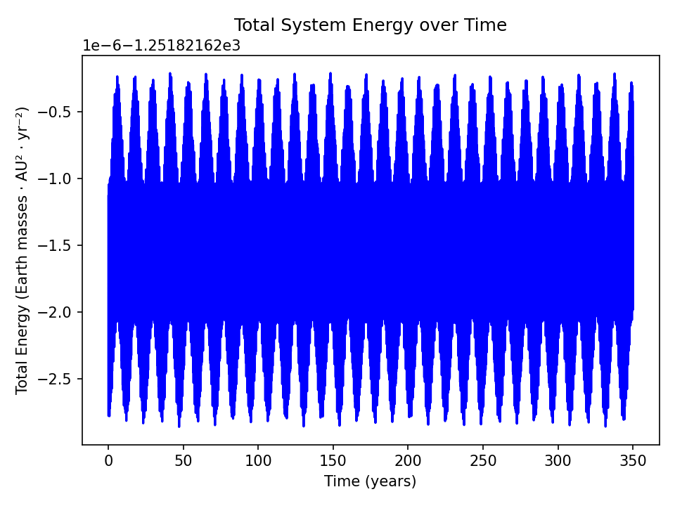
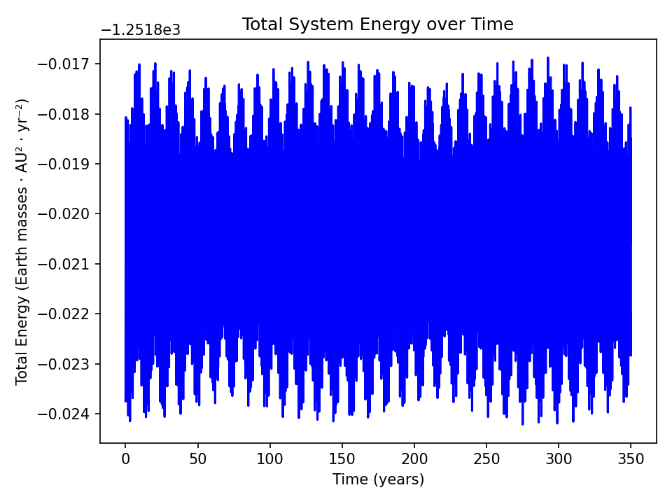
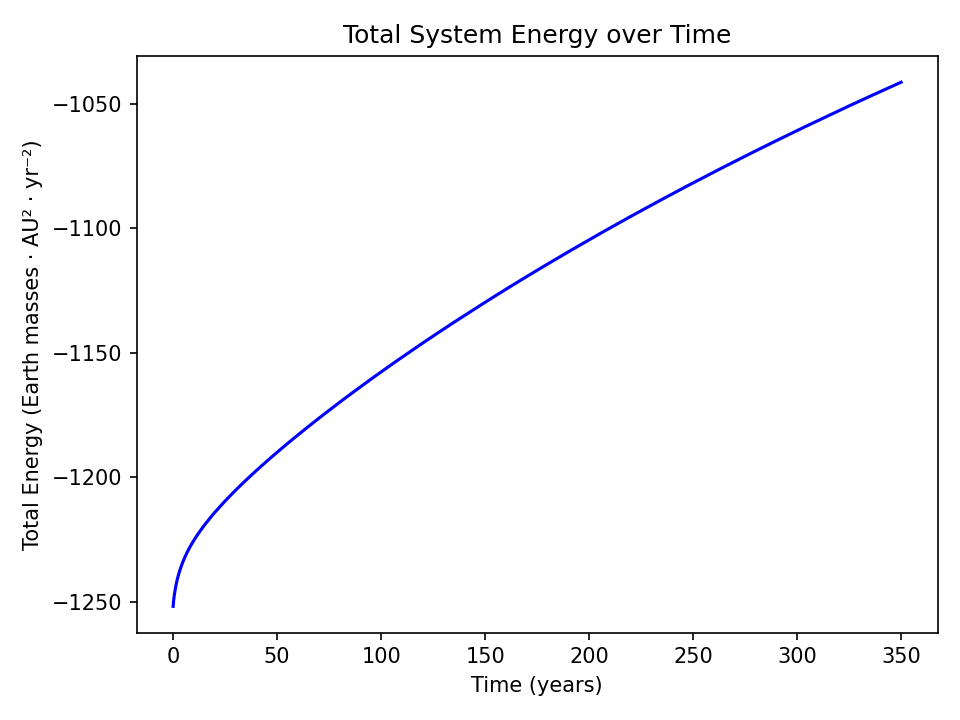
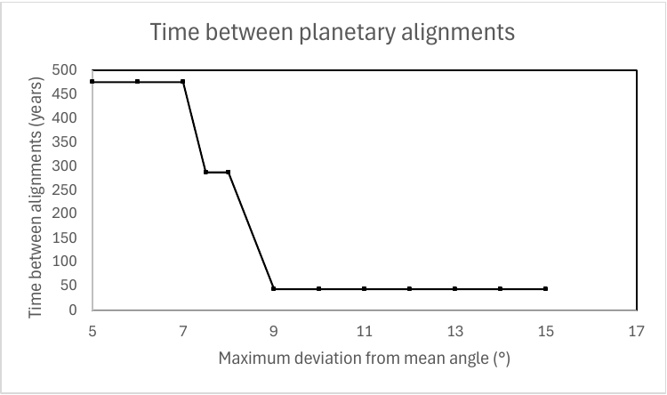

# Solar-system-simulation

A simplified 2D simulation of the solar system (the Sun, the four inner planets and Jupiter), written in Python using numpy and matplotlib. Every body feels the gravity of every other body, so the Sun isn't fixed in place and gets pulled around slightly by Jupiter.

The main point of the project was to compare three different integration methods for the equations of motion:

- Beeman
- Euler-Cromer
- Direct Euler

When you run the program it asks which method to use and then which experiment to run:

1. Orbital periods - counts each time a planet crosses the x axis and averages the period over a few orbits
2. Energy of the system over time - writes the total energy to energy_file.txt and plots it
3. Time until planetary alignment - runs until all the planets are within a chosen angle of their mean angle

After the run finishes it animates the orbits.

The masses, orbital radii, sizes and colours of the bodies are read in from bodies.json. Units are AU, years and Earth masses.

## Results

### Energy

All three methods were run for 350 years with a timestep of 0.001 years.

| Method | Energy variation (relative) |
|---|---|
| Beeman | about 2e-9 |
| Euler-Cromer | about 6e-6 |
| Direct Euler | about 17% |

Beeman and Euler-Cromer both keep the energy roughly constant, it just oscillates a little. Direct Euler keeps adding energy every step so the planets slowly drift outwards.

Beeman:



Euler-Cromer:



Direct Euler:



(The y axis scales are very different between the three.)

### Orbital periods (Beeman)

| Body | Orbital radius (AU) | Period (years) |
|---|---|---|
| Mercury | 0.3473 | 0.2047 |
| Venus | 0.7233 | 0.6150 |
| Earth | 1.0000 | 0.9996 |
| Mars | 1.5238 | 1.8799 |
| Jupiter | 5.2038 | 11.837 |

The planets start on circular orbits, so these follow Kepler's third law. Jupiter's is a bit off because the Sun moves too.

### Planetary alignment



Time until all five planets line up for different maximum angles. Below about 9 degrees the time jumps from around 43 years to several hundred.

## Running it

```
pip install -r requirements.txt
python solar_system.py
```
